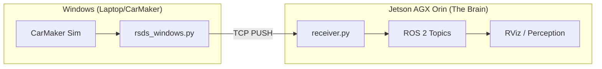

Yesterday was about understanding the **RSDS** stream on the Windows side. Today was about the actual "Bridge"—the moment we finally got the eyes of the car (Windows) talking to its brain (the Jetson AGX Orin).

It wasn't as simple as plugging in a cable. We hit a wall almost immediately.

## The Bandwidth Reality Check

First, why are we doing this over Ethernet or Wi-Fi? Every FS-AI student eventually asks: *"Can't we just use the CAN bus?"*

The answer is a hard **no**.

- Standard CAN bus maxes out at **1 Mbps** (0.125 MB/s).
- Our sensor stream (RGB + Depth + LiDAR) totals roughly **66 MB/s**.

Trying to push 66 megabytes through a 1 Mbps pipe isn't just a bottleneck; it’s like trying to fit a firehose through a needle. High-bandwidth sensors *demand* a TCP/IP connection. While Wi-Fi is an option, we use Ethernet for the rock-solid stability and low latency needed when streaming 60+ MB of data every second.

## The "Inbound Hang" Mystery

The logical architecture was: **Jetson (Client) -> Windows (Server)**.

I set up the Jetson to request the data and pointed it at the Windows PC's IP. I disabled the Windows firewall. I checked the ports.

The result? **Indefinite hanging.**

Windows would happily talk *out* to the Jetson, but it absolutely refused to let the Jetson initiate a connection *in*. Even with the firewall completely off, the connection just died in silence.


_Video: Attempting to connect from Jetson to Windows — the terminal just hangs indefinitely._

## The Engineering Pivot: Reverse TCP

If Windows won't let us in through the front door, we make Windows use our door.

I decided to flip the architecture on its head. I turned the Jetson into the **TCP Server** and wrote a bridge script on the Windows side (`rsds_windows.py`) to act as the **Client**.

Instead of the Jetson asking for data, the Windows PC now **pushes** the data to the Jetson. This "Reverse TCP" approach bypassed the Windows inbound firewall issues instantly.

## The Receiver: Translation to ROS 2

On the Jetson, I built the `rsds_client` package. Its core script, `receiver.py`, runs three independent threads (ports 5000, 5001, and 5002) that listen for incoming packets.

We use a custom binary header to keep things synchronized. Each packet starts with a "Magic" identifier (`RSDS` for camera, `LIDR` for LiDAR) so the receiver knows exactly what it's looking at. Once the bytes are in, we package them into `sensor_msgs/Image` and `sensor_msgs/PointCloud2` topics.

## The Result: Live Streaming

The moment of truth came when I launched RViz. For the first time, I could see the simulation world rendered live on the Jetson—RGB, Depth, and LiDAR all streaming in at once.


_Video: Live sensor data from CarMaker appearing in ROS 2 on the Jetson._

We have RGB. We have Depth. We have a LiDAR cloud. **We have eyes.**

With the bridge open, I was also able to bring the YOLO detector online. For the first time, we could see the detector recognizing cones in the live simulation feed. It’s a huge milestone, but the results were... interesting, but very much expected. There are some very noticeable issues with what the car is "seeing" in the simulation that we’ll need to dive into in the next post.
